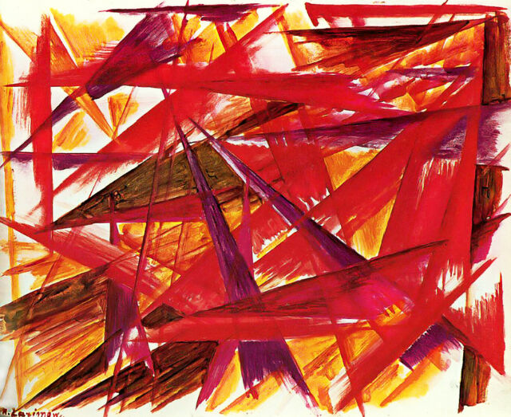

# Rayonism

Rayonism is a collaborative R&D project to build
a Merge/Sharding testnet during the ETHGlobal Scaling Hackathon.

# License

See [`LICENSE`](./LICENSE) file.

Website theme was adapted from [`nicolas-van/bootstrap-4-github-pages](https://github.com/nicolas-van/bootstrap-4-github-pages) template.
